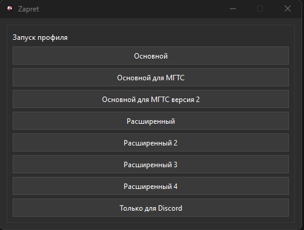
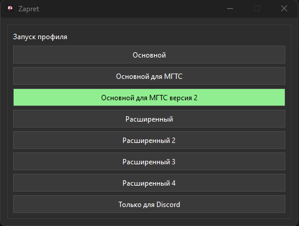

# 🚀 GUI Zapret: Удобный обход DPI для Windows

[](https://www.microsoft.com/windows/)
[](https://github.com/dadzaguad/zapret/releases)
**GUI Zapret** - это графический интерфейс пользователя (GUI) **только для Windows**, созданный как удобная оболочка для проекта [**Zapret**](https://github.com/Flowseal/zapret-discord-youtube.git) (и используемой им утилиты `winws.exe`). Приложение упрощает запуск и остановку преднастроенных профилей команд для обхода DPI (Deep Packet Inspection) и восстановления доступа к сервисам (например, Discord, Google), которые могут блокироваться вашим интернет-провайдером.


Программа собирается в виде одного `.exe` файла с помощью [PyInstaller](https://pyinstaller.org/) и не требует установки Python или других зависимостей на компьютере пользователя.

---

## ✨ Основные возможности

*   **Удобный Запуск Zapret:** Легко запускайте и останавливайте профили Zapret одним кликом через GUI.
*   **Готовые Профили:** Использует конфигурации из `commands.json` для различных сценариев обхода DPI.
*   **Только для Windows:** Разработано специально для Windows, использует соответствующие API.
*   **Интерфейс на PyQt6:** Простой и понятный графический интерфейс.
*   **Системный Трей:** Возможность свернуть приложение в трей для работы в фоне.
*   **Управление Правами:** Автоматическая проверка и запрос прав администратора (через UAC), необходимых для работы Zapret.
*   **Готовый `.exe`:** Распространяется как исполняемый файл, не требующий установки.
*   **Мультиязычность:** Поддержка русского и английского языков.

---

## 📸 Скриншоты

<table>
  <tr>
    <td align="center">
      
      <br/><em>Главное окно</em>
    </td>
    <td align="center">
      
      <br/><em>Запущенный профиль</em>
    </td>
   </tr>
</table>


---

## 🚀 Начало работы

1.  Перейдите в раздел [**Releases**](https://github.com/dadzaguad/zapret/releases) репозитория `GUI Zapret`.
2.  Скачайте последний `.exe` файл (`Zapret.exe`) из раздела `Assets`.
3.  Запустите скачанный `.exe` файл.
4.  **Важно:** Приложение проверит, есть ли у него права администратора. Если нет, оно попытается перезапуститься с ними, что вызовет стандартное окно **Запроса прав администратора (UAC)** от Windows. **Необходимо подтвердить этот запрос**, чтобы приложение (и лежащий в его основе Zapret) могло корректно работать.
5.  В главном окне программы нажмите на кнопку с названием нужного профиля (из `commands.json`), чтобы запустить обход DPI. Активная кнопка подсветится зеленым.
6.  Для остановки обхода снова нажмите на активную (зеленую) кнопку.
7.  Окно приложения можно закрыть (нажав на крестик) - оно свернется в системный трей. Клик левой кнопкой мыши по иконке в трее восстановит окно, правый клик откроет меню с опциями "Восстановить" и "Выход".

---

## 🛠️ Сборка из исходников (Для разработчиков GUI)

Если вы хотите внести изменения в сам **графический интерфейс** или собрать `.exe` самостоятельно:

1.  **Клонируйте репозиторий `GUI Zapret`:**
    ```bash
    git clone https://github.com/dadzaguad/zapret.git
    cd zapret
    ```
2.  **Создайте и активируйте виртуальное окружение (рекомендуется):**
    ```bash
    python -m venv venv
    .\venv\Scripts\activate
    ```
3.  **Установите зависимости:**
    Убедитесь, что у вас установлен Python 3.10 или выше.
    ```bash
    pip install -r requirements.txt
    ```
4.  **Установите PyInstaller:**
    ```bash
    pip install pyinstaller
    ```
5.  **Соберите проект:**
    Используется файл спецификации `main.spec`. Убедитесь, что все ресурсы (иконка, переводы, `commands.json`, а также `winws.exe` и `.txt` списки из оригинального Zapret, помещенные в `src/scripts/bin` и `src/scripts` соответственно) находятся на своих местах согласно `main.spec`.
    ```bash
    pyinstaller main.spec
    ```
6.  **Результат:** Готовый `Zapret.exe` будет находиться в папке `dist`.

---

## 🙏 Благодарности

*   Оригинальному проекту [**Zapret**](https://github.com/Flowseal/zapret-discord-youtube.git) и его авторам.
*   Библиотеке [PyQt6](https://www.riverbankcomputing.com/software/pyqt/) за GUI-фреймворк.
*   Инструменту [PyInstaller](https://pyinstaller.org/) за возможность создания `.exe`.

---

## 🏗️ CI/CD (Сборка через GitHub Actions)

Процесс сборки `.exe`, его подписи (самоподписанным сертификатом) и публикации релиза автоматизирован с помощью GitHub Actions (`.github/workflows/build.yml`):

---
